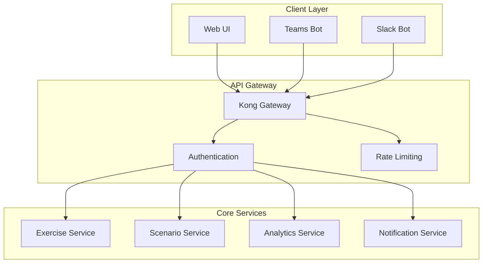

# GameDay Platform


> AI-driven tabletop exercise platform for enhancing organizational resilience through automated scenario generation and coordination.

## Introduction

GameDay Platform revolutionizes tabletop exercises by leveraging AI-driven scenario generation and automated coordination. The platform enables Information Security, IT Operations, and Business Continuity teams to conduct regular, lightweight exercises that enhance organizational resilience while significantly reducing resource overhead.

### Key Differentiators

- 🤖 AI-powered scenario generation
- 🔄 Automated exercise coordination
- 🌐 Multi-platform delivery
- 📊 Real-time analytics
- 🔒 Enterprise-grade security
- 📋 Compliance framework mapping

## Features

### Exercise Management
- Context-aware scenario generation using advanced AI
- Dynamic inject delivery and timeline management
- Real-time participant coordination
- Automated compliance mapping

### Multi-Platform Integration
- Microsoft Teams integration
- Slack workspace connectivity
- Enterprise calendar system integration
- SSO provider support (SAML 2.0, OAuth 2.0)

### Analytics & Reporting
- Real-time gap analysis
- Compliance coverage visualization
- Performance metrics tracking
- Trend analysis and recommendations

## Architecture



## Getting Started

### Prerequisites

- Node.js >= 20.0.0
- Python >= 3.11
- Docker >= 24.0.0
- Kubernetes >= 1.27.0
- 16GB RAM minimum
- 50GB available storage

#### Supported Platforms
- Linux (Ubuntu 22.04+, RHEL 8+)
- macOS (12+)
- Windows 11 with WSL2

### Installation

1. Clone the repository:
```bash
git clone https://github.com/gameday/gameday-platform.git
cd gameday-platform
```

2. Copy environment template:
```bash
cp .env.example .env
```

3. Start development environment:
```bash
docker-compose up -d
```

### Configuration

#### Required Environment Variables
```bash
# Core Configuration
NODE_ENV=development
PYTHON_ENV=development
PORT=3000

# Authentication
AUTH0_DOMAIN=your-domain.auth0.com
AUTH0_CLIENT_ID=your-client-id
AUTH0_CLIENT_SECRET=your-client-secret

# Database
MONGODB_URI=mongodb://localhost:27017/gameday
REDIS_URL=redis://localhost:6379

# Integration
TEAMS_BOT_ID=your-teams-bot-id
SLACK_BOT_TOKEN=your-slack-bot-token
```

## Usage

### Local Development

Start development environment:
```bash
# Start all services
docker-compose up -d

# Frontend development
cd src/web
npm install
npm run dev

# Backend development
cd src/backend
python -m venv venv
source venv/bin/activate
pip install -r requirements.txt
python manage.py runserver
```

### Testing

```bash
# Run frontend tests
cd src/web
npm test

# Run backend tests
cd src/backend
pytest

# Run integration tests
npm run test:integration
```

### Deployment

```bash
# Build production images
docker-compose -f docker-compose.prod.yml build

# Deploy to Kubernetes
kubectl apply -f infrastructure/k8s/
```

## Security

- All communications encrypted using TLS 1.3
- Authentication via enterprise SSO providers
- Role-based access control (RBAC)
- Regular security scanning and updates
- Compliance with SOC 2, GDPR, and HIPAA requirements

## Troubleshooting

Common issues and solutions are documented in our [Wiki](https://github.com/gameday/gameday-platform/wiki/troubleshooting).

For additional support:
- Check our [Issue Tracker](https://github.com/gameday/gameday-platform/issues)
- Join our [Community Discord](https://discord.gg/gameday)
- Contact enterprise support (enterprise customers only)

## Contributing

Please read [CONTRIBUTING.md](CONTRIBUTING.md) for details on our code of conduct and development process.

## License

This project is licensed under the MIT License - see the [LICENSE](LICENSE) file for details.

## Repository Structure

```
gameday-platform/
├── src/
│   ├── backend/        # Backend microservices
│   └── web/           # Frontend application
├── infrastructure/    # Infrastructure as Code
├── docs/             # Additional documentation
├── .github/          # GitHub workflows and templates
├── docker-compose.yml
├── CONTRIBUTING.md
├── LICENSE
└── README.md
```

## Acknowledgments

- OpenAI for LLM capabilities
- The open-source community
- Our enterprise customers and partners

---

Built with ❤️ by the GameDay Platform Team