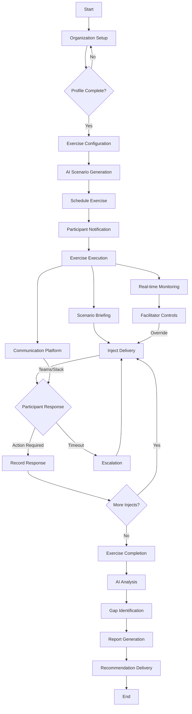
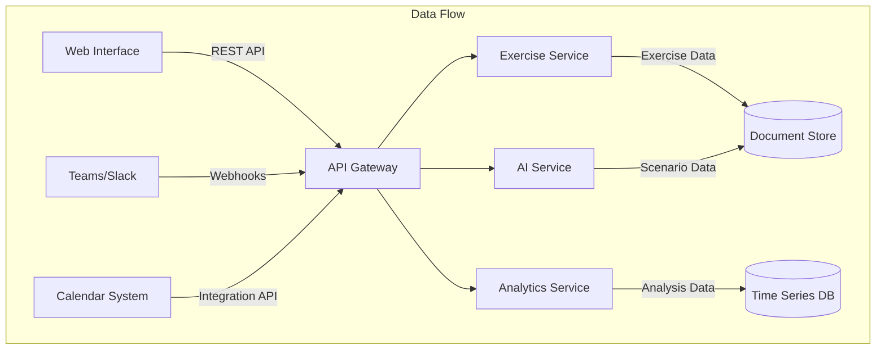
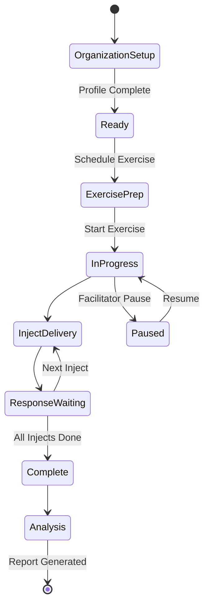
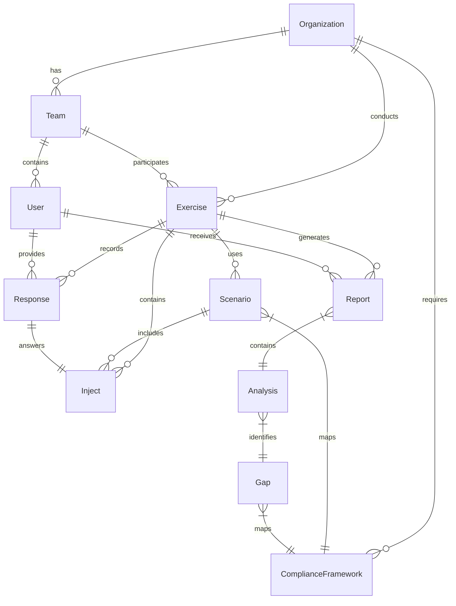
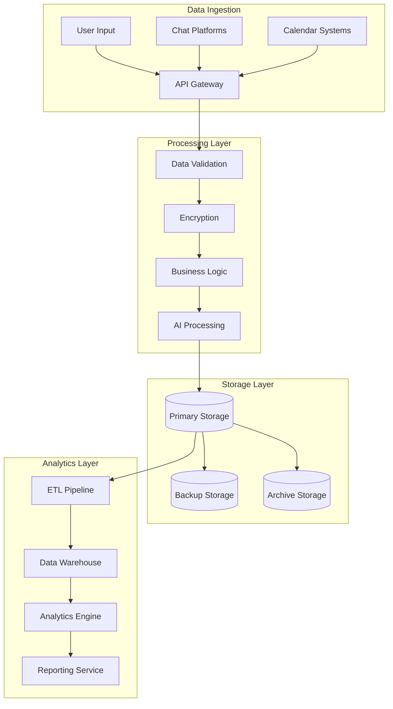
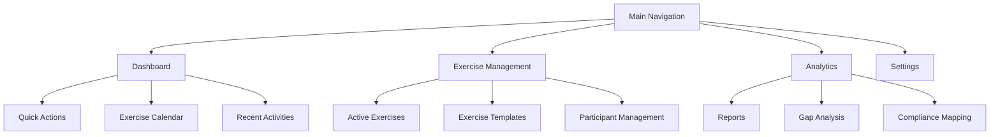
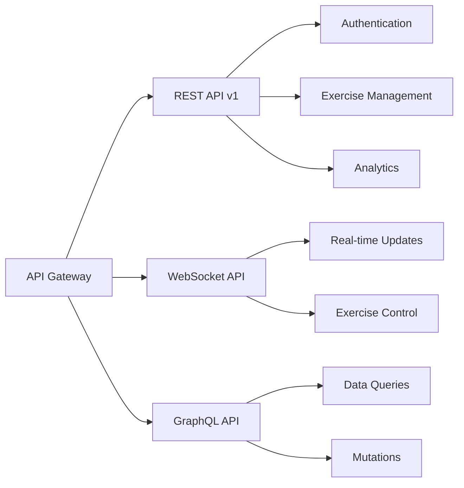

# Product Requirements Document (PRD)

# 1. INTRODUCTION

## 1.1 Purpose

This Software Requirements Specification (SRS) document provides a comprehensive description of the GameDay Platform, a system designed to modernize and streamline tabletop exercises. This document is intended for:

- Development teams implementing the system
- Project managers overseeing the implementation
- Quality assurance teams validating the requirements
- Stakeholders evaluating the proposed solution
- Future maintainers of the system

## 1.2 Scope

The GameDay Platform is a cloud-native application that enables organizations to conduct frequent, AI-driven tabletop exercises. The system encompasses:

### 1.2.1 Core Functionalities

- AI-powered scenario generation based on organizational context
- Multi-platform exercise coordination and execution
- Automated analysis and gap identification
- Compliance-mapped reporting and recommendations
- Integration with existing communication tools (Slack, Teams)

### 1.2.2 Key Benefits

- Increased exercise frequency through lightweight sessions
- Improved incident response capabilities
- Automated coordination and scheduling
- Data-driven insights for continuous improvement
- Compliance requirement validation
- Cross-platform accessibility

### 1.2.3 System Boundaries

The system includes:
- Web-based administration interface
- Exercise execution environment
- AI scenario generation engine
- Analytics and reporting system
- Integration APIs for third-party platforms

The system excludes:
- Physical infrastructure monitoring
- Actual incident response tools
- Real-time system testing capabilities
- Production environment modifications

# 2. PRODUCT DESCRIPTION

## 2.1 Product Perspective

The GameDay Platform operates as a standalone cloud-native SaaS solution that integrates with existing enterprise communication and scheduling systems. The system architecture consists of:

- Web-based frontend for administration and exercise management
- Microservices backend infrastructure
- Integration layers for third-party services
- AI engine for scenario generation and analysis
- Secure data storage for organization and exercise information

Key Integration Points:
- Microsoft Teams and Slack for exercise delivery
- Enterprise calendar systems for scheduling
- SSO providers for authentication
- Video conferencing platforms for exercise coordination
- Compliance framework databases for mapping and reporting

## 2.2 Product Functions

The primary functions of the GameDay Platform include:

1. Organization Profile Management
   - Context configuration
   - Team structure definition
   - Technology stack documentation
   - Compliance requirement mapping

2. AI-Powered Exercise Generation
   - Context-aware scenario creation
   - Dynamic inject generation
   - Real-time scenario adaptation
   - Compliance-mapped exercise design

3. Exercise Coordination
   - Automated scheduling
   - Multi-platform notifications
   - Virtual space provisioning
   - Real-time participant tracking

4. Exercise Execution
   - Scenario presentation
   - Inject delivery
   - Response recording
   - Facilitator controls

5. Analysis and Reporting
   - Gap identification
   - Compliance validation
   - Recommendation generation
   - Progress tracking

## 2.3 User Characteristics

| User Type | Technical Expertise | Primary Functions | Access Level |
|-----------|-------------------|-------------------|--------------|
| System Administrator | High | Platform configuration, user management | Full system access |
| Exercise Administrator | Medium | Exercise planning, template management | Organization-wide access |
| Exercise Facilitator | Medium | Exercise execution, real-time control | Exercise-specific control |
| Participant | Low to Medium | Exercise participation, action documentation | Limited exercise access |
| Observer | Low | Exercise monitoring, report viewing | Read-only access |

## 2.4 Constraints

1. Technical Constraints
   - Real-time communication latency must be under 500ms
   - Browser compatibility requirements (Chrome, Firefox, Safari, Edge)
   - Mobile device support limitations
   - API rate limits for third-party integrations

2. Regulatory Constraints
   - SOC 2 compliance requirements
   - Data privacy regulations (GDPR, CCPA)
   - Industry-specific compliance frameworks
   - Data retention policies

3. Operational Constraints
   - Maximum concurrent exercise limit
   - Storage limitations for exercise recordings
   - Bandwidth restrictions for video conferencing
   - Integration capabilities with legacy systems

4. Business Constraints
   - Subscription-based pricing model
   - Service level agreements (SLAs)
   - Support hours and availability
   - Implementation timeframes

## 2.5 Assumptions and Dependencies

### Assumptions
1. Organizations have stable internet connectivity
2. Users have basic computer literacy
3. Organizations maintain updated browser versions
4. Exercise participants have access to required communication tools
5. Organizations can provide necessary context information

### Dependencies
1. External Services
   - Cloud infrastructure availability
   - Third-party API stability
   - SSO provider uptime
   - Communication platform reliability

2. Technical Dependencies
   - AI model availability and performance
   - Database scalability
   - Network bandwidth
   - Integration endpoint accessibility

3. Business Dependencies
   - User adoption and engagement
   - Organization context accuracy
   - Compliance framework updates
   - Industry standard changes

# 3. PROCESS FLOWCHART

# 4. FUNCTIONAL REQUIREMENTS

## 4.1 Organization Profile Management (F1)

### ID: F1
### Description
System for managing organizational context, team structures, and compliance requirements
### Priority: High
### Requirements

| ID | Requirement | Priority |
|---|-------------|----------|
| F1.1 | Create and edit organization profiles with industry vertical, size, and business model | High |
| F1.2 | Configure technology stack and system inventory | High |
| F1.3 | Define team structure, roles, and responsibilities | High |
| F1.4 | Map applicable compliance frameworks and requirements | High |
| F1.5 | Manage user access and permissions | High |

## 4.2 AI Scenario Generation (F2)

### ID: F2
### Description
AI-powered system for creating contextually relevant exercise scenarios
### Priority: High
### Requirements

| ID | Requirement | Priority |
|---|-------------|----------|
| F2.1 | Generate scenarios based on organizational context using LLM | High |
| F2.2 | Create dynamic injects that adapt to participant responses | High |
| F2.3 | Support multiple incident types (security, operational, business continuity) | High |
| F2.4 | Map scenarios to compliance requirements | Medium |
| F2.5 | Allow manual override and customization of generated scenarios | Medium |

## 4.3 Exercise Coordination (F3)

### ID: F3
### Description
Automated system for scheduling and coordinating exercises across platforms
### Priority: High
### Requirements

| ID | Requirement | Priority |
|---|-------------|----------|
| F3.1 | Schedule exercises with calendar system integration | High |
| F3.2 | Send multi-platform notifications (email, Slack, Teams) | High |
| F3.3 | Provision virtual meeting spaces automatically | Medium |
| F3.4 | Track participant availability and attendance | Medium |
| F3.5 | Support recurring exercise scheduling | Low |

## 4.4 Exercise Execution (F4)

### ID: F4
### Description
Real-time exercise management and participant interaction system
### Priority: High
### Requirements

| ID | Requirement | Priority |
|---|-------------|----------|
| F4.1 | Present scenario briefings and injects through web interface | High |
| F4.2 | Record participant actions and communications | High |
| F4.3 | Provide facilitator controls for exercise management | High |
| F4.4 | Support multi-platform participant interaction | Medium |
| F4.5 | Enable real-time exercise state modifications | Medium |

## 4.5 Analysis and Reporting (F5)

### ID: F5
### Description
Automated analysis of exercise outcomes and report generation
### Priority: High
### Requirements

| ID | Requirement | Priority |
|---|-------------|----------|
| F5.1 | Analyze exercise outcomes using AI | High |
| F5.2 | Identify gaps in people, process, and technology | High |
| F5.3 | Generate compliance-mapped recommendations | High |
| F5.4 | Produce detailed exercise reports | High |
| F5.5 | Track improvements across multiple exercises | Medium |

## 4.6 Platform Integration (F6)

### ID: F6
### Description
Integration with external systems and communication platforms
### Priority: Medium
### Requirements

| ID | Requirement | Priority |
|---|-------------|----------|
| F6.1 | Integrate with Microsoft Teams | High |
| F6.2 | Integrate with Slack | High |
| F6.3 | Support SSO authentication providers | High |
| F6.4 | Connect with video conferencing platforms | Medium |
| F6.5 | Provide REST API for custom integrations | Low |

# 5. NON-FUNCTIONAL REQUIREMENTS

## 5.1 Performance Requirements

| Requirement | Description | Target Metric |
|-------------|-------------|---------------|
| Response Time | Maximum latency for web interface interactions | < 200ms |
| Real-time Updates | Latency for exercise inject delivery | < 500ms |
| AI Processing | Scenario generation completion time | < 30 seconds |
| Analysis Processing | Exercise analysis and report generation | < 5 minutes |
| Concurrent Users | Maximum simultaneous users per organization | 500 |
| API Performance | REST API response time | < 100ms |
| Database Queries | Query execution time | < 50ms |
| WebSocket Connections | Maximum concurrent WebSocket connections | 10,000 |

## 5.2 Safety Requirements

| Requirement | Description |
|-------------|-------------|
| Data Backup | Automated hourly backups with 30-day retention |
| Failover | Automatic failover to secondary systems within 30 seconds |
| Data Recovery | Recovery Point Objective (RPO) of 1 hour |
| System Recovery | Recovery Time Objective (RTO) of 15 minutes |
| State Management | Automatic exercise state preservation during system interruptions |
| Error Handling | Graceful degradation of services during partial system failure |
| Data Validation | Input validation and sanitization for all user-provided data |

## 5.3 Security Requirements

| Category | Requirements |
|----------|--------------|
| Authentication | - Multi-factor authentication support - SSO integration with major providers - Password complexity enforcement - Session management with 30-minute timeout |
| Authorization | - Role-based access control (RBAC) - Least privilege principle enforcement - Resource-level permissions - API key management |
| Data Protection | - End-to-end encryption for all data in transit - AES-256 encryption for data at rest - Encryption key rotation every 90 days |
| Audit | - Comprehensive audit logging - User activity tracking - Security event monitoring - Access attempt logging |
| Network Security | - WAF implementation - DDoS protection - Regular vulnerability scanning - Network segregation |

## 5.4 Quality Requirements

### 5.4.1 Availability
- System uptime: 99.9% (excluding planned maintenance)
- Planned maintenance windows: Maximum 4 hours monthly
- Service degradation notification: Within 5 minutes
- Redundancy across multiple availability zones

### 5.4.2 Maintainability
- Modular microservices architecture
- Automated deployment pipelines
- Comprehensive API documentation
- Code coverage minimum: 80%
- Regular dependency updates

### 5.4.3 Usability
- Web Content Accessibility Guidelines (WCAG) 2.1 Level AA compliance
- Mobile-responsive design
- Maximum 3 clicks to reach any feature
- Consistent UI/UX across platforms
- Multi-language support

### 5.4.4 Scalability
- Horizontal scaling capability
- Auto-scaling based on load
- Database sharding support
- CDN integration for static assets
- Message queue implementation for async processing

### 5.4.5 Reliability
- Mean Time Between Failures (MTBF): > 720 hours
- Mean Time To Recovery (MTTR): < 15 minutes
- Error rate: < 0.1% of all requests
- Data consistency check mechanisms
- Automated system health monitoring

## 5.5 Compliance Requirements

| Framework | Requirements |
|-----------|--------------|
| SOC 2 Type II | - Annual audit certification - Continuous monitoring - Security controls documentation - Change management procedures |
| GDPR | - Data privacy controls - Right to be forgotten implementation - Data portability support - Privacy policy enforcement |
| CCPA | - Personal information tracking - Opt-out mechanisms - Data deletion capabilities - Privacy notice requirements |
| ISO 27001 | - Information security controls - Risk assessment procedures - Security incident management - Business continuity planning |
| HIPAA | - PHI protection measures - Access controls - Audit trails - Encryption requirements |

# 6. DATA REQUIREMENTS

## 6.1 Data Models

## 6.2 Data Storage

### 6.2.1 Primary Storage Systems

| Data Type | Storage System | Purpose |
|-----------|----------------|----------|
| Organization Profiles | Document Store (MongoDB) | Flexible schema for org context |
| User Data | Relational DB (PostgreSQL) | ACID compliance for user management |
| Exercise Data | Time Series DB (InfluxDB) | Performance metrics and timeline data |
| Analytics Data | Data Warehouse (Snowflake) | Long-term analysis and reporting |
| File Attachments | Object Storage (S3) | Exercise artifacts and documents |

### 6.2.2 Data Retention

| Data Category | Retention Period | Archive Policy |
|---------------|------------------|----------------|
| Exercise Records | 7 years | Cold storage after 1 year |
| User Activity Logs | 2 years | Archive after 90 days |
| System Metrics | 1 year | Aggregate after 30 days |
| Chat Transcripts | 3 years | Compress after 180 days |
| Analytics Data | 5 years | Summarize after 1 year |

### 6.2.3 Backup and Recovery

- Real-time replication across availability zones
- Hourly incremental backups
- Daily full backups retained for 30 days
- Monthly backups retained for 1 year
- Point-in-time recovery capability within 7 days
- Cross-region backup replication

## 6.3 Data Processing

### 6.3.1 Data Security

| Security Layer | Implementation |
|----------------|----------------|
| Encryption at Rest | AES-256 encryption |
| Encryption in Transit | TLS 1.3 |
| Access Control | Row-level security |
| Key Management | AWS KMS rotation |
| Data Masking | PII/sensitive data masking |
| Audit Logging | All data access logged |

### 6.3.2 Data Transformation

| Stage | Process | Output |
|-------|---------|---------|
| Ingestion | Validation, normalization | Clean data |
| Enrichment | Context addition, classification | Enhanced data |
| Analysis | Pattern recognition, gap identification | Insights |
| Reporting | Aggregation, visualization | Reports |

### 6.3.3 Data Quality

- Validation rules for all input data
- Automated data consistency checks
- Data completeness monitoring
- Real-time data quality scoring
- Automated anomaly detection
- Data lineage tracking

# 7. EXTERNAL INTERFACES

## 7.1 User Interfaces

### 7.1.1 Web Application Interface

| Component | Requirements |
|-----------|--------------|
| Responsive Design | - Support for desktop (1920x1080) to mobile (360x640) - Fluid layout adaptation - Touch-friendly controls |
| Accessibility | - WCAG 2.1 Level AA compliance - Screen reader compatibility - Keyboard navigation support |
| Browser Support | - Chrome 90+ - Firefox 88+ - Safari 14+ - Edge 90+ |
| Design System | - Material Design components - Consistent color scheme - Dark mode support |

### 7.1.2 Interface Layouts

## 7.2 Software Interfaces

### 7.2.1 Integration Requirements

| System | Interface Type | Purpose | Protocol |
|--------|---------------|----------|-----------|
| Microsoft Teams | REST API/WebSocket | Exercise delivery, notifications | HTTPS/WSS |
| Slack | Events API | Exercise delivery, notifications | HTTPS |
| SSO Providers | SAML/OAuth 2.0 | Authentication | HTTPS |
| Calendar Systems | CalDAV/REST | Schedule management | HTTPS |
| Video Conferencing | REST API | Meeting provisioning | HTTPS |
| LLM Service | REST API | Scenario generation | HTTPS |

### 7.2.2 Data Exchange Formats

| Interface | Format | Validation |
|-----------|--------|------------|
| REST APIs | JSON/JWT | JSON Schema |
| WebSocket | JSON | Message Schema |
| SSO | SAML/JWT | X.509 Certificates |
| Calendar | iCal/JSON | RFC 5545 |
| Analytics | Protobuf | Schema Registry |

## 7.3 Communication Interfaces

### 7.3.1 Network Requirements

| Protocol | Port | Purpose | Security |
|----------|------|---------|----------|
| HTTPS | 443 | API/Web Access | TLS 1.3 |
| WSS | 443 | Real-time Updates | TLS 1.3 |
| gRPC | 50051 | Internal Services | mTLS |
| MQTT | 8883 | Event Broadcasting | TLS 1.3 |

### 7.3.2 API Specifications

### 7.3.3 Integration Patterns

| Pattern | Implementation | Use Case |
|---------|---------------|-----------|
| Pub/Sub | MQTT/Redis | Real-time updates |
| Request-Reply | REST/gRPC | CRUD operations |
| Event Sourcing | Kafka | Audit logging |
| Circuit Breaker | Resilience4j | External services |
| API Gateway | Kong/Envoy | Traffic management |

# 8. APPENDICES

## 8.1 GLOSSARY

| Term | Definition |
|------|------------|
| Inject | A scenario event or update delivered to participants during an exercise |
| Gap Analysis | Systematic examination of differences between current and desired capabilities |
| Tabletop Exercise | Discussion-based session where team members meet to discuss roles during an emergency |
| Scenario | A hypothetical situation designed to help organizations assess their response capabilities |
| LLM | Large Language Model - AI system used for natural language processing and generation |
| Compliance Framework | A structured set of guidelines and practices organizations must follow |
| RBAC | Role-Based Access Control - method of regulating system access based on roles |
| WebSocket | Communication protocol providing full-duplex communication channels over TCP |
| mTLS | Mutual Transport Layer Security - two-way authentication protocol |

## 8.2 ACRONYMS

| Acronym | Definition |
|---------|------------|
| API | Application Programming Interface |
| CCPA | California Consumer Privacy Act |
| CDN | Content Delivery Network |
| GDPR | General Data Protection Regulation |
| HIPAA | Health Insurance Portability and Accountability Act |
| JWT | JSON Web Token |
| MQTT | Message Queuing Telemetry Transport |
| PHI | Protected Health Information |
| REST | Representational State Transfer |
| SAML | Security Assertion Markup Language |
| SLA | Service Level Agreement |
| SOC | System and Organization Controls |
| SSO | Single Sign-On |
| TLS | Transport Layer Security |
| WCAG | Web Content Accessibility Guidelines |
| WSS | WebSocket Secure |

## 8.3 ADDITIONAL REFERENCES

| Category | Reference |
|----------|-----------|
| Security Standards | - NIST Cybersecurity Framework - ISO/IEC 27001:2013 - CIS Controls v8 |
| Development | - React Documentation - Material Design Guidelines - OpenAPI Specification 3.0 |
| Compliance | - SOC 2 Compliance Guide - GDPR Requirements - HIPAA Security Rule |
| Integration | - Microsoft Teams API Documentation - Slack API Guidelines - OAuth 2.0 Specification |
| Infrastructure | - Docker Documentation - Kubernetes Best Practices - AWS Well-Architected Framework |

## 8.4 REVISION HISTORY

| Version | Date | Author | Description |
|---------|------|---------|-------------|
| 1.0 | Initial | - | Initial document creation |