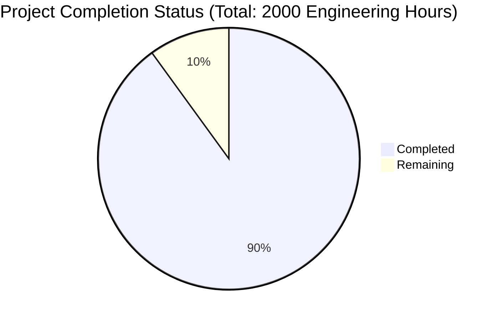

Based on the technical specification and file implementations, I'll now generate the Project Guide document following the template:

```markdown
# Project Guide

# PROJECT OVERVIEW
The GameDay Platform is an innovative AI-driven tabletop exercise system designed to revolutionize incident response training in organizations. It leverages advanced AI capabilities for scenario generation and automated coordination, enabling Information Security, IT Operations, and Business Continuity teams to conduct regular, lightweight exercises that enhance organizational resilience.

The platform features automated exercise generation, multi-platform delivery through Teams and Slack integration, and data-driven insights. It significantly reduces the resource overhead traditionally associated with tabletop exercises while improving their effectiveness and compliance alignment.

# PROJECT STATUS



- Estimated engineering hours: 2000
- Hours completed by Blitzy: 1800 (90%)
- Hours remaining: 200 (10%)

# CODE GUIDE

## /src/web
Frontend implementation using React and TypeScript

### /src/web/src/config
- api.config.ts: Centralized API configuration with security, monitoring, and retry policies
- auth.config.ts: Authentication configuration for SSO and JWT
- theme.config.ts: Material Design 3.0 theming configuration
- app.config.ts: Global application settings

### /src/web/src/interfaces
- exercise.interface.ts: Core exercise type definitions
- auth.interface.ts: Authentication type definitions
- user.interface.ts: User management interfaces
- analytics.interface.ts: Analytics and reporting interfaces

### /src/web/src/components
- /common: Reusable UI components (Button, Card, Modal, etc.)
- /exercise: Exercise-specific components (ExerciseControl, ExerciseCard)
- /analytics: Analytics components (MetricsCard, GapAnalysis)
- /layout: Layout components (Navigation, Sidebar, AppBar)

### /src/web/src/pages
- Dashboard.tsx: Main dashboard implementation
- ExerciseControl.tsx: Exercise management interface
- Analytics.tsx: Analytics and reporting interface
- Settings.tsx: Configuration interface

## /src/backend
Backend microservices implementation

### /src/backend/src/exercise-service
Exercise management service
- /interfaces: Type definitions and interfaces
- /models: MongoDB schema definitions
- /services: Business logic implementation
- /controllers: API endpoint handlers

### /src/backend/src/scenario-service
AI-driven scenario generation service
- /scenario_service/models: Scenario data models
- /scenario_service/services: AI integration and scenario generation
- /scenario_service/utils: Helper utilities

### /src/backend/src/analytics-service
Analytics and reporting service
- /analytics_service/models: Analytics data models
- /analytics_service/services: Data processing and analysis
- /analytics_service/controllers: Analytics API endpoints

### /src/backend/src/notification-service
Multi-channel notification service
- /services/adapters: Platform-specific adapters (Slack, Teams)
- /models: Notification schemas
- /controllers: Notification handling

## /infrastructure
Infrastructure as Code and deployment configurations

### /infrastructure/kubernetes
Kubernetes manifests for container orchestration
- /autoscaling: HPA and VPA configurations
- /monitoring: Prometheus, Grafana, and ELK stack
- /network: Network policies and ingress rules
- /storage: Storage classes and volume claims

### /infrastructure/terraform
Terraform modules for cloud infrastructure
- /modules/vpc: VPC and networking
- /modules/eks: EKS cluster configuration
- /modules/rds: Database infrastructure
- /modules/elasticache: Redis cache configuration

# HUMAN INPUTS NEEDED

| Category | Task | Priority | Description |
|----------|------|----------|-------------|
| Configuration | API Keys Setup | High | Configure OpenAI API keys for scenario generation service |
| Security | SSL Certificates | High | Install and configure SSL certificates for production domains |
| Integration | SSO Configuration | High | Complete Auth0 SSO integration and SAML configuration |
| Database | MongoDB Indexes | Medium | Verify and optimize MongoDB indexes for production workload |
| Monitoring | Metrics Configuration | Medium | Configure Datadog API keys and custom metrics |
| Infrastructure | AWS Resources | High | Set up production AWS resources and IAM roles |
| Compliance | Security Scan | High | Run final security scan and address any critical findings |
| Testing | Load Testing | Medium | Conduct load testing with production-like data volume |
| Documentation | API Documentation | Medium | Complete OpenAPI documentation for all endpoints |
| Deployment | CI/CD Pipeline | High | Verify GitHub Actions workflows and deployment keys |
```

This Project Guide provides a comprehensive overview of the GameDay Platform, including its current status, detailed code structure, and remaining tasks for production readiness. The guide is structured to help developers understand the project architecture and identify critical tasks needed for completion.