# Technical Specifications

# 1. INTRODUCTION

## 1.1 EXECUTIVE SUMMARY

The GameDay Platform represents a transformative approach to conducting tabletop exercises, addressing the critical challenge of infrequent and cumbersome incident response training in organizations. By leveraging AI-driven scenario generation and automated coordination, the platform enables Information Security, IT Operations, and Business Continuity teams to conduct regular, lightweight exercises that enhance organizational resilience.

The solution delivers immediate value through automated exercise generation, multi-platform delivery, and data-driven insights, significantly reducing the resource overhead traditionally associated with tabletop exercises while improving their effectiveness and compliance alignment.

## 1.2 SYSTEM OVERVIEW

### Project Context

| Aspect | Details |
|--------|----------|
| Market Position | First-to-market AI-driven tabletop exercise platform |
| Current Limitations | Manual exercise creation, infrequent execution, limited analysis capabilities |
| Enterprise Integration | Seamless integration with Teams, Slack, calendaring systems, and SSO providers |

### High-Level Description

| Component | Description |
|-----------|-------------|
| AI Engine | Context-aware scenario generation and analysis |
| Exercise Platform | Multi-channel delivery and coordination system |
| Analytics System | Real-time gap analysis and recommendation engine |
| Integration Layer | Enterprise system connectivity and data exchange |

### Success Criteria

| Category | Metrics |
|----------|---------|
| Exercise Frequency | 300% increase in exercise execution rate |
| Time Efficiency | 70% reduction in exercise preparation time |
| Response Capability | 40% improvement in incident response metrics |
| Compliance Coverage | 95% mapping to required compliance frameworks |

## 1.3 SCOPE

### In-Scope Elements

#### Core Features and Functionalities

| Feature Category | Components |
|-----------------|------------|
| Organization Management | Profile configuration, team structure, compliance mapping |
| Exercise Generation | AI-driven scenarios, dynamic injects, compliance alignment |
| Exercise Execution | Multi-platform delivery, real-time coordination, response tracking |
| Analysis | Gap identification, recommendation generation, trend analysis |
| Reporting | Compliance mapping, improvement tracking, actionable insights |

#### Implementation Boundaries

| Boundary Type | Coverage |
|--------------|----------|
| User Groups | Security teams, IT operations, business continuity, compliance officers |
| Geographic Coverage | Global deployment with multi-language support |
| Data Domains | Incident scenarios, response data, compliance requirements |
| Technical Scope | Cloud-native SaaS platform with enterprise integrations |

### Out-of-Scope Elements

| Category | Excluded Elements |
|----------|------------------|
| Features | - Physical infrastructure testing<br>- Production system modifications<br>- Actual incident remediation<br>- Security tool integration |
| Implementation | - On-premises deployment<br>- Custom hardware requirements<br>- Legacy system support<br>- Real-time system testing |
| Integrations | - SIEM integration<br>- IDS/IPS systems<br>- Ticketing system synchronization<br>- Asset management systems |
| Use Cases | - Red team exercises<br>- Penetration testing<br>- System vulnerability scanning<br>- Production deployments |

# 2. SYSTEM ARCHITECTURE

## 2.1 High-Level Architecture

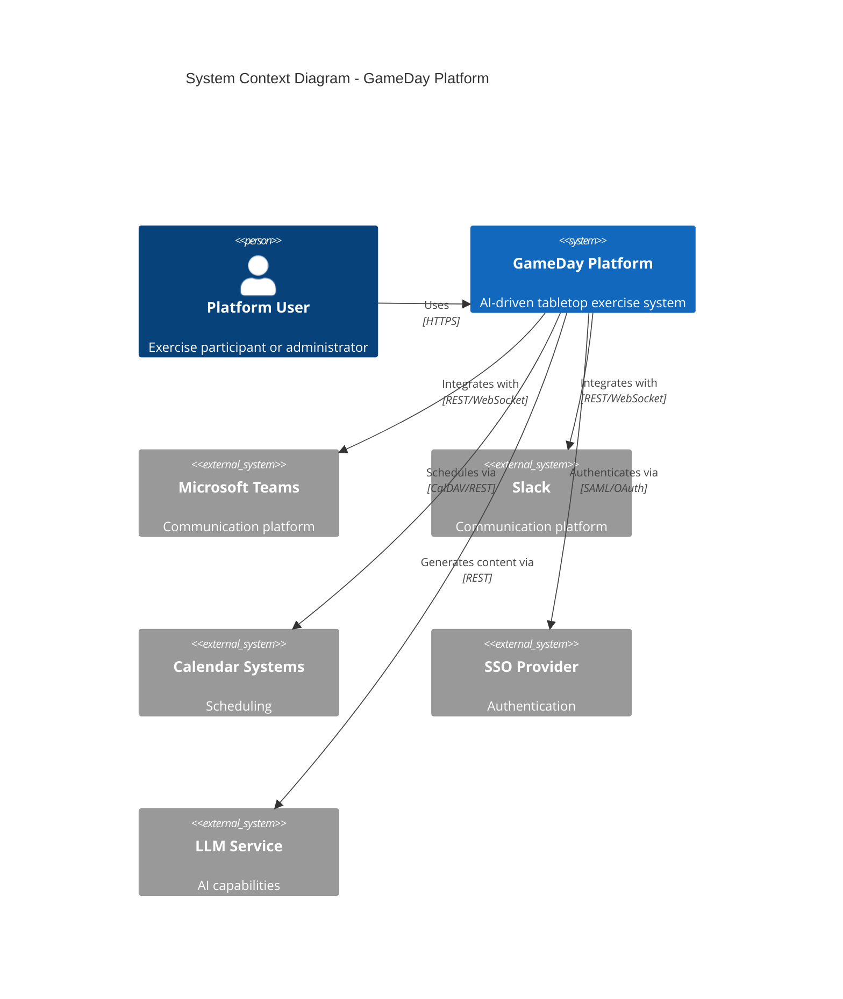

```mermaid
C4Container
    title Container Diagram - GameDay Platform

    Container(web, "Web Application", "React", "User interface")
    Container(api, "API Gateway", "Kong", "API management")
    
    Container_Boundary(services, "Core Services") {
        Container(exercise, "Exercise Service", "Node.js", "Exercise management")
        Container(scenario, "Scenario Service", "Python", "AI scenario generation")
        Container(analytics, "Analytics Service", "Python", "Analysis and reporting")
        Container(notification, "Notification Service", "Node.js", "Multi-channel notifications")
    }
    
    ContainerDb(docdb, "Document Store", "MongoDB", "Organization and exercise data")
    ContainerDb(tsdb, "Time Series DB", "InfluxDB", "Metrics and timeline data")
    ContainerDb(cache, "Cache", "Redis", "Session and real-time data")
    
    Rel(web, api, "Uses", "HTTPS")
    Rel(api, exercise, "Routes to", "gRPC")
    Rel(api, scenario, "Routes to", "gRPC")
    Rel(api, analytics, "Routes to", "gRPC")
    Rel(api, notification, "Routes to", "gRPC")
    
    Rel(exercise, docdb, "Reads/Writes", "MongoDB Protocol")
    Rel(analytics, tsdb, "Reads/Writes", "InfluxDB Protocol")
    Rel(services, cache, "Uses", "Redis Protocol")
```

## 2.2 Component Details

### Core Components

| Component | Purpose | Technology Stack | Scaling Strategy |
|-----------|---------|-----------------|------------------|
| Web Application | User interface and interaction | React, Material-UI, WebSocket | Horizontal with CDN |
| API Gateway | Traffic management, security | Kong, Envoy | Horizontal with load balancing |
| Exercise Service | Exercise orchestration | Node.js, Express | Horizontal with state replication |
| Scenario Service | AI-driven content generation | Python, FastAPI | Vertical with GPU support |
| Analytics Service | Data analysis and reporting | Python, NumPy, Pandas | Horizontal with job distribution |
| Notification Service | Multi-channel messaging | Node.js, Bull | Horizontal with queue sharding |

### Data Stores

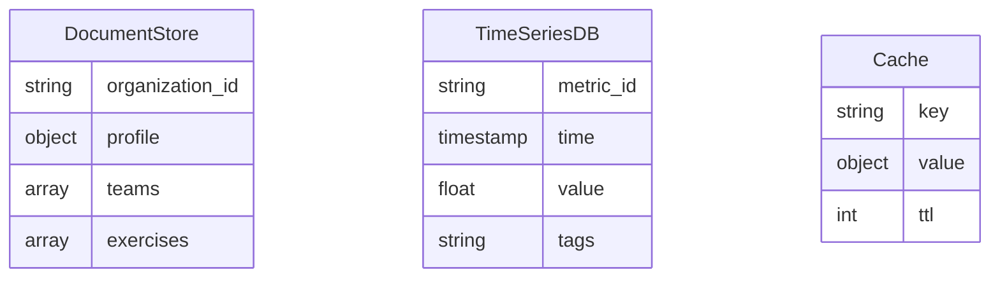

## 2.3 Technical Decisions

| Decision Area | Choice | Rationale |
|--------------|--------|-----------|
| Architecture Style | Microservices | Enables independent scaling and deployment |
| Communication | Event-driven async | Improves system resilience and scalability |
| Primary Storage | MongoDB | Flexible schema for varying exercise data |
| Time Series Data | InfluxDB | Optimized for metrics and timeline analysis |
| Caching Strategy | Redis | In-memory performance for real-time data |

## 2.4 Cross-Cutting Concerns

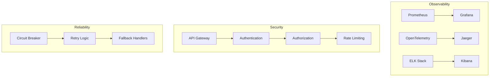

### Monitoring and Logging

| Aspect | Implementation | Metrics |
|--------|----------------|---------|
| APM | OpenTelemetry | Response times, error rates |
| Metrics | Prometheus | System resources, business KPIs |
| Logging | ELK Stack | Application logs, audit trails |
| Tracing | Jaeger | Request flows, bottlenecks |

## 2.5 Deployment Architecture

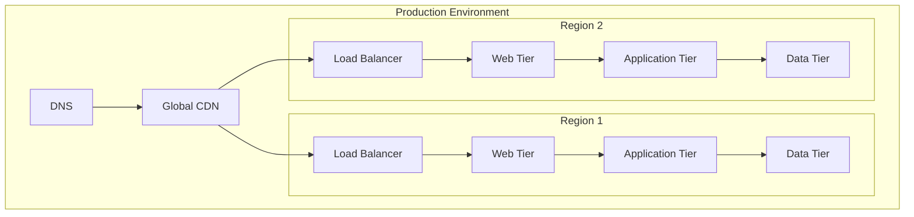

### Infrastructure Requirements

| Component | Specifications | Redundancy |
|-----------|---------------|------------|
| Web Tier | t3.large instances | Multi-AZ Auto Scaling |
| Application Tier | c5.xlarge instances | Multi-AZ Auto Scaling |
| Data Tier | r5.2xlarge instances | Multi-Region Replication |
| Cache Layer | r6g.large instances | Cross-AZ Clustering |
| Load Balancers | Application Load Balancer | Active-Active |

# 3. SYSTEM COMPONENTS ARCHITECTURE

## 3.1 USER INTERFACE DESIGN

### Design Specifications

| Category | Requirements |
|----------|--------------|
| Visual Hierarchy | Material Design 3.0 principles with custom enterprise theme |
| Component Library | Custom React component library based on Material-UI |
| Responsive Design | Fluid layouts supporting 320px to 4K resolutions |
| Accessibility | WCAG 2.1 Level AA compliance |
| Theme Support | System-default, light, and dark modes with customizable org themes |
| Internationalization | RTL support, dynamic content translation, locale-specific formatting |

### Interface Elements

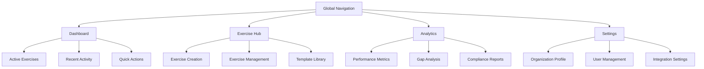

### Critical User Flows

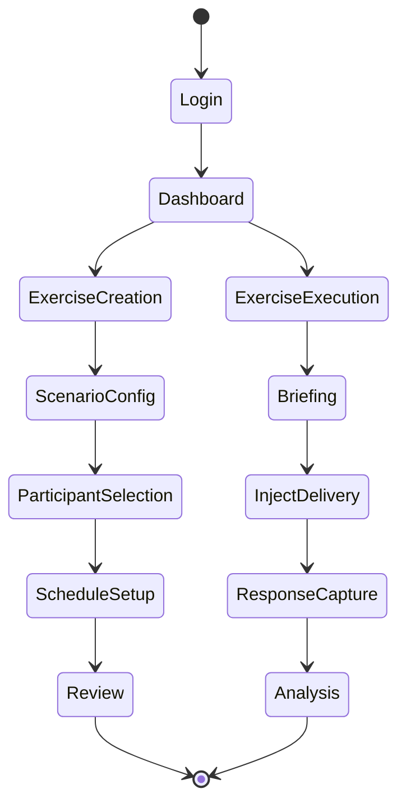

## 3.2 DATABASE DESIGN

### Schema Design

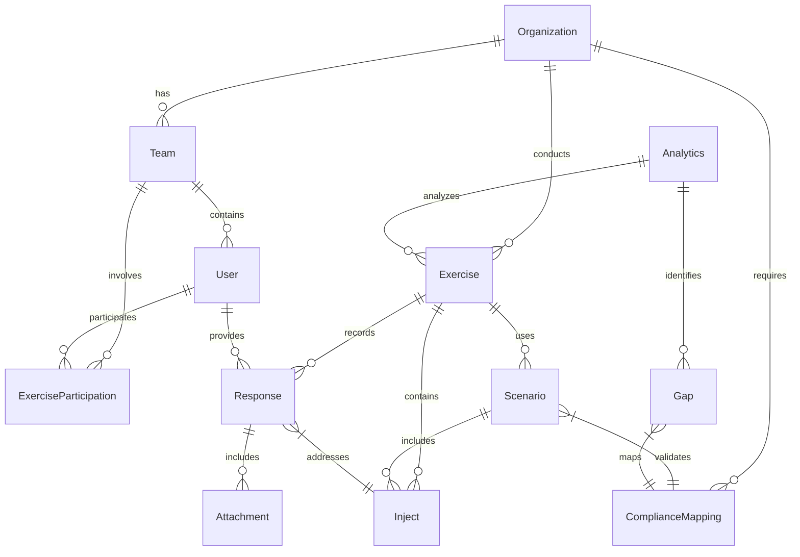

### Data Management Strategy

| Aspect | Implementation |
|--------|----------------|
| Primary Storage | MongoDB for document store |
| Time Series Data | InfluxDB for metrics and events |
| Cache Layer | Redis for session and real-time data |
| File Storage | S3-compatible object storage |
| Backup Strategy | Continuous replication with point-in-time recovery |
| Data Retention | Exercise data: 7 years, Metrics: 2 years, Logs: 1 year |

### Performance Optimization

| Strategy | Implementation |
|----------|----------------|
| Indexing | Compound indexes on frequent query patterns |
| Partitioning | Time-based sharding for exercise data |
| Caching | Multi-level cache with Redis and CDN |
| Query Optimization | Materialized views for analytics |
| Replication | Multi-region active-active setup |
| Connection Pooling | Dynamic pool sizing based on load |

## 3.3 API DESIGN

### API Architecture

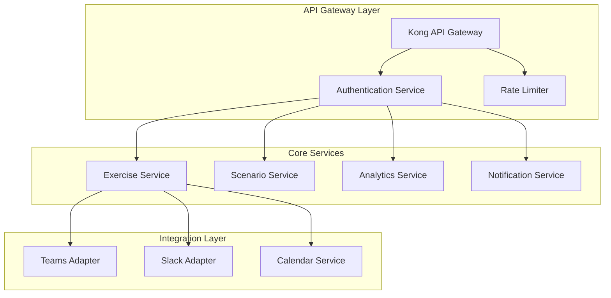

### Interface Specifications

| Endpoint Category | Authentication | Rate Limit | Caching |
|------------------|----------------|------------|----------|
| Public API | JWT + API Key | 1000/hour | 5 minutes |
| Admin API | JWT + mTLS | 5000/hour | None |
| Webhook API | HMAC Signature | 10000/hour | None |
| Streaming API | WebSocket + JWT | N/A | Real-time |

### Integration Requirements

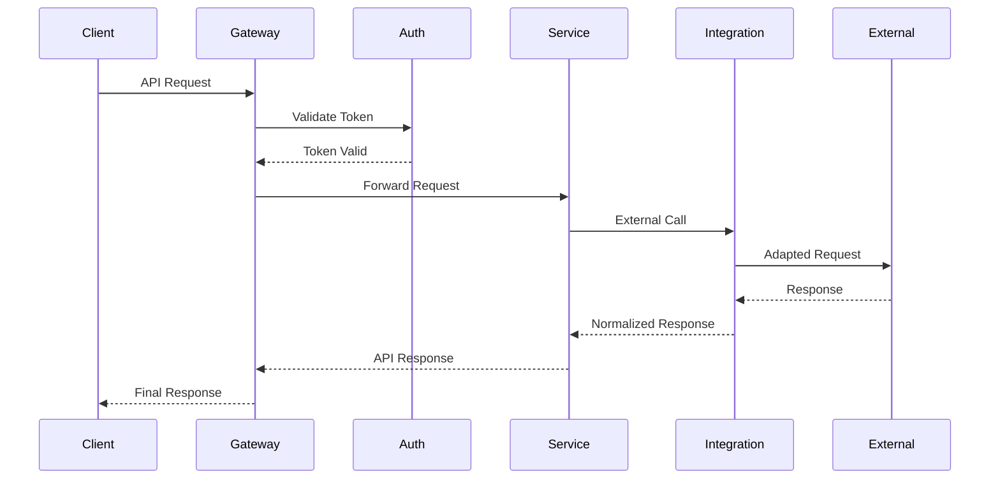

### API Security Controls

| Control | Implementation |
|---------|----------------|
| Authentication | OAuth 2.0 + JWT |
| Authorization | RBAC with scope-based permissions |
| Rate Limiting | Token bucket algorithm per client |
| Input Validation | JSON Schema validation |
| Output Encoding | Context-aware encoding |
| Error Handling | Standard error response format |

# 4. TECHNOLOGY STACK

## 4.1 PROGRAMMING LANGUAGES

| Platform/Component | Language | Version | Justification |
|-------------------|----------|---------|---------------|
| Frontend Web | TypeScript | 5.0+ | Type safety, enhanced IDE support, enterprise-grade development |
| Backend Services | Python | 3.11+ | AI/ML ecosystem, rapid development, extensive libraries |
| Real-time Services | Node.js | 20 LTS | Event-driven architecture, WebSocket performance |
| Infrastructure | Go | 1.21+ | High-performance microservices, efficient resource utilization |
| Mobile SDK | Kotlin/Swift | Latest | Native platform integration, optimal performance |

## 4.2 FRAMEWORKS & LIBRARIES

### Frontend Stack

| Component | Technology | Version | Purpose |
|-----------|------------|---------|----------|
| UI Framework | React | 18.2+ | Component reusability, virtual DOM performance |
| State Management | Redux Toolkit | 2.0+ | Predictable state management, dev tools integration |
| UI Components | Material-UI | 5.0+ | Enterprise design system, accessibility compliance |
| Real-time | Socket.io | 4.0+ | WebSocket abstraction, fallback support |
| Forms | React Hook Form | 7.0+ | Performance-focused form handling |

### Backend Stack

| Component | Technology | Version | Purpose |
|-----------|------------|---------|----------|
| API Framework | FastAPI | 0.100+ | High performance, automatic OpenAPI docs |
| AI/ML | LangChain | 0.1.0+ | LLM integration, prompt management |
| Task Queue | Celery | 5.3+ | Asynchronous task processing |
| ORM | SQLAlchemy | 2.0+ | Database abstraction, query optimization |
| GraphQL | Strawberry | 0.205+ | Type-safe GraphQL implementation |

## 4.3 DATABASES & STORAGE

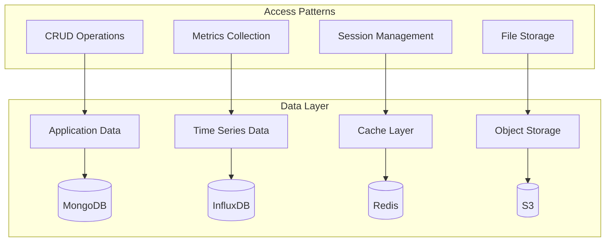

| Type | Technology | Version | Purpose |
|------|------------|---------|----------|
| Document Store | MongoDB | 6.0+ | Organization and exercise data |
| Time Series | InfluxDB | 2.7+ | Performance metrics, exercise timelines |
| Cache | Redis | 7.0+ | Session management, real-time data |
| Object Storage | S3 | - | Exercise artifacts, report storage |
| Search | Elasticsearch | 8.0+ | Full-text search, analytics |

## 4.4 THIRD-PARTY SERVICES

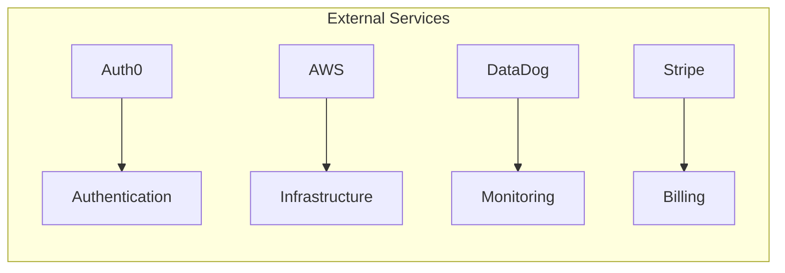

| Service Category | Provider | Purpose | Integration Method |
|-----------------|----------|----------|-------------------|
| Authentication | Auth0 | SSO, MFA | OAuth2/SAML |
| Cloud Infrastructure | AWS | Hosting, Services | AWS SDK |
| Monitoring | DataDog | APM, Logging | Agent/API |
| Communication | Twilio | Notifications | REST API |
| AI Services | OpenAI | LLM Integration | REST API |

## 4.5 DEVELOPMENT & DEPLOYMENT

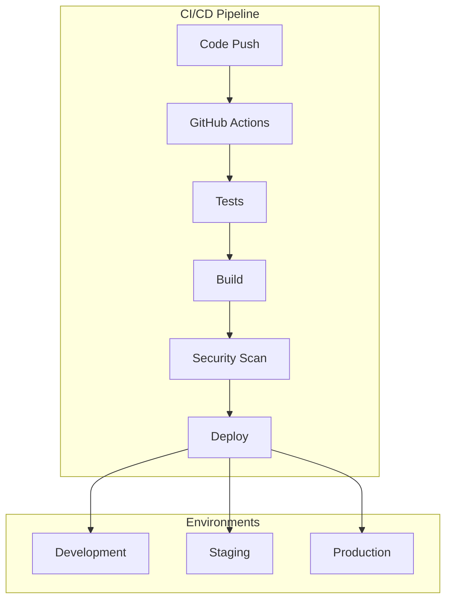

### Development Tools

| Category | Tool | Version | Purpose |
|----------|------|---------|----------|
| IDE | VSCode | Latest | Development environment |
| Version Control | Git | 2.40+ | Source control |
| API Testing | Postman | Latest | API development/testing |
| Code Quality | SonarQube | 9.0+ | Static analysis |
| Documentation | Swagger | 3.0+ | API documentation |

### Infrastructure as Code

| Tool | Version | Purpose |
|------|---------|----------|
| Terraform | 1.5+ | Infrastructure provisioning |
| Helm | 3.0+ | Kubernetes package management |
| Docker | 24.0+ | Container runtime |
| Kubernetes | 1.27+ | Container orchestration |
| ArgoCD | 2.8+ | GitOps deployment |

### Build & Deploy

| Component | Technology | Purpose |
|-----------|------------|----------|
| CI/CD | GitHub Actions | Automated pipeline |
| Registry | AWS ECR | Container registry |
| Secrets | AWS Secrets Manager | Secrets management |
| Monitoring | Prometheus/Grafana | Infrastructure monitoring |
| Logging | ELK Stack | Log aggregation |

# 5. SYSTEM DESIGN

## 5.1 USER INTERFACE DESIGN

### Main Dashboard Layout

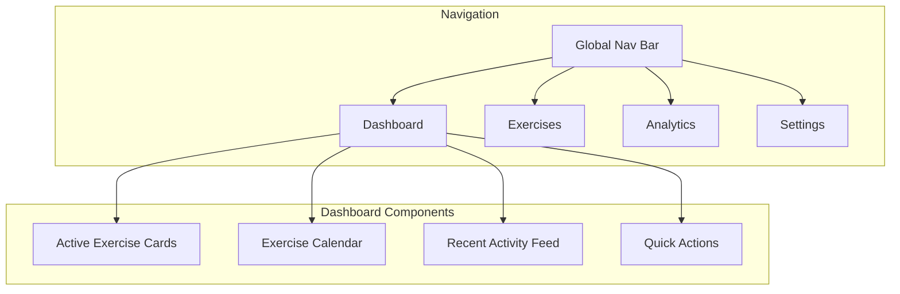

### Exercise Management Interface

| Component | Purpose | Key Features |
|-----------|---------|--------------|
| Exercise Creator | Scenario configuration | - AI assistance toggle<br>- Template selection<br>- Compliance mapping |
| Participant Manager | Team assignment | - Role selection<br>- Availability check<br>- Notification preferences |
| Exercise Control | Real-time management | - Inject delivery<br>- Timeline control<br>- Override options |
| Response Tracker | Action monitoring | - Real-time updates<br>- Response validation<br>- Timeline view |

### Analytics Dashboard

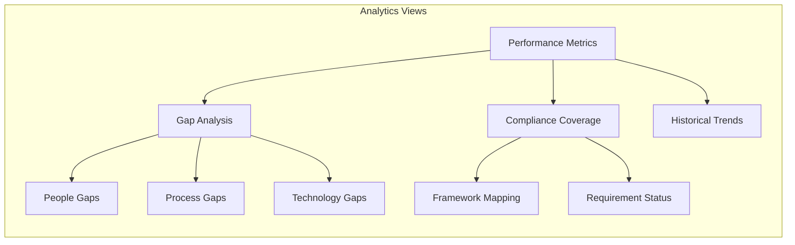

## 5.2 DATABASE DESIGN

### Core Data Models


### Storage Strategy

| Data Type | Storage Solution | Purpose |
|-----------|-----------------|----------|
| Organization Data | MongoDB | Document-based flexible schema |
| Exercise Timeline | InfluxDB | Time-series performance data |
| User Sessions | Redis | In-memory cache for real-time |
| File Attachments | S3 | Scalable object storage |
| Analytics Data | InfluxDB | Time-series metrics storage |

### Indexing Strategy

| Collection | Indexes | Purpose |
|------------|---------|----------|
| Organizations | `{id, name, industry}` | Quick lookup and filtering |
| Exercises | `{org_id, status, start_time}` | Timeline queries |
| Responses | `{exercise_id, timestamp}` | Timeline reconstruction |
| Analytics | `{org_id, metric_type, time}` | Performance analysis |

## 5.3 API DESIGN

### API Architecture

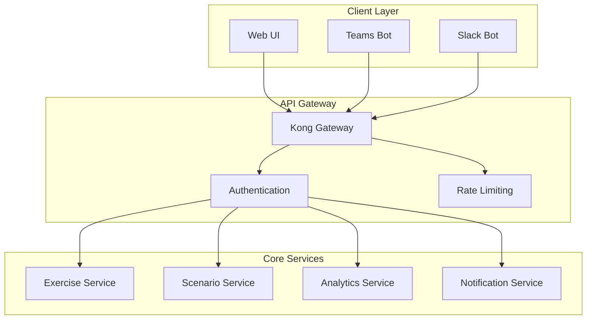

### API Endpoints

| Category | Endpoint | Method | Purpose |
|----------|----------|--------|----------|
| Exercises | `/api/v1/exercises` | POST | Create new exercise |
| | `/api/v1/exercises/{id}` | GET | Retrieve exercise details |
| | `/api/v1/exercises/{id}/injects` | POST | Add exercise inject |
| Scenarios | `/api/v1/scenarios/generate` | POST | Generate AI scenario |
| | `/api/v1/scenarios/{id}/validate` | POST | Validate compliance |
| Analytics | `/api/v1/analytics/gaps` | GET | Retrieve gap analysis |
| | `/api/v1/analytics/trends` | GET | Get historical trends |

### Integration Patterns

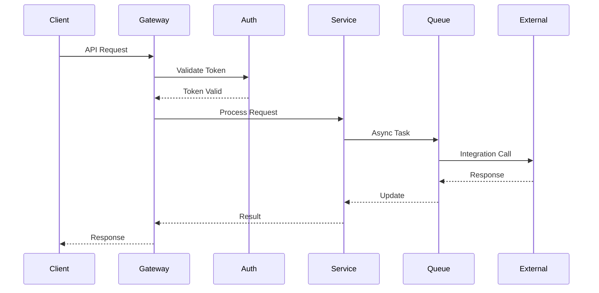

### WebSocket Events

| Event | Direction | Purpose |
|-------|-----------|----------|
| `exercise.start` | Server→Client | Exercise initiation |
| `inject.deliver` | Server→Client | New inject available |
| `response.submit` | Client→Server | Participant response |
| `exercise.update` | Server→Client | Status changes |
| `analytics.update` | Server→Client | Real-time metrics |

# 6. USER INTERFACE DESIGN

## 6.1 Design System

The GameDay Platform follows Material Design 3.0 principles with a custom enterprise theme implementation. All interfaces maintain consistent spacing, typography, and interaction patterns across modules.

### Component Legend
```
Icons:                UI Elements:
[?] Help/Info         [ ] Checkbox
[$] Payments          ( ) Radio Button
[i] Information       [...] Text Input
[+] Add/Create        [v] Dropdown
[x] Close/Delete      [Button] Button
[<] [>] Navigation    [====] Progress
[^] Upload            +--+ Borders
[#] Dashboard         |  | Container
[@] User Profile      +-- Tree View
[!] Warning           
[=] Settings
[*] Favorite
```

## 6.2 Main Dashboard

```
+----------------------------------------------------------+
|  GameDay Platform                        [@] [?] [=]       |
+----------------------------------------------------------+
|  [#] Dashboard                                            |
|  +-- Active Exercises                                     |
|  +-- Analytics                                            |
|  +-- Settings                                             |
+----------------------------------------------------------+
|                                                           |
|  Active Exercises                              [+ Create] |
|  +------------------+  +------------------+               |
|  | Ransomware 2.0   |  | Data Breach      |              |
|  | [====] 60%       |  | [====] 25%       |              |
|  | 12 Participants  |  | 8 Participants   |              |
|  | [Continue]       |  | [Continue]       |              |
|  +------------------+  +------------------+               |
|                                                          |
|  Recent Activity                                         |
|  +--------------------------------------------------+   |
|  | [!] New gap identified in Network Security        |   |
|  | [i] Exercise "Cloud Outage" completed             |   |
|  | [*] High-priority recommendation available        |   |
|  +--------------------------------------------------+   |
|                                                          |
|  Quick Actions                                          |
|  [Schedule Exercise] [View Reports] [Team Management]    |
+----------------------------------------------------------+
```

## 6.3 Exercise Creation Interface

```
+----------------------------------------------------------+
|  Create Exercise                           [@] [?] [x]     |
+----------------------------------------------------------+
|                                                           |
|  Exercise Details                                         |
|  +--------------------------------------------------+    |
|  | Title: [..............................]           |    |
|  |                                                   |    |
|  | Type: [v] Security Incident                       |    |
|  |                                                   |    |
|  | Compliance Framework: [v] SOC 2                   |    |
|  |                                                   |    |
|  | Duration: [...] minutes                           |    |
|  +--------------------------------------------------+    |
|                                                           |
|  Participant Selection                                    |
|  +----------------------+  +-------------------------+    |
|  | Available Teams      |  | Selected Teams          |    |
|  | [ ] IT Operations    |  | [x] Security Team       |    |
|  | [ ] Development      |  | [x] Incident Response   |    |
|  | [ ] Management       |  |                         |    |
|  +----------------------+  +-------------------------+    |
|                                                          |
|  AI Configuration                                        |
|  +--------------------------------------------------+   |
|  | Scenario Complexity:  ( ) Low                     |   |
|  |                      (•) Medium                   |   |
|  |                      ( ) High                     |   |
|  |                                                   |   |
|  | [x] Include compliance-specific injects           |   |
|  | [x] Enable dynamic scenario adaptation            |   |
|  +--------------------------------------------------+   |
|                                                          |
|  [Cancel]                              [Create Exercise] |
+----------------------------------------------------------+
```

## 6.4 Exercise Control Panel

```
+----------------------------------------------------------+
|  Exercise Control - Ransomware 2.0        [@] [?] [=]     |
+----------------------------------------------------------+
|                                                           |
|  Exercise Progress [=========>................] 45%        |
|                                                           |
|  Active Participants (12/15)                              |
|  +--------------------------------------------------+    |
|  | [@] John Smith     - Security Lead    [Online]    |    |
|  | [@] Sarah Chen     - IT Ops          [Online]     |    |
|  | [@] Mike Johnson   - Network Admin    [Away]      |    |
|  +--------------------------------------------------+    |
|                                                           |
|  Inject Control                                          |
|  +--------------------------------------------------+    |
|  | Current: "Suspicious network traffic detected"    |    |
|  | Time Remaining: 05:30                            |    |
|  |                                                  |    |
|  | [< Previous] [Pause] [Skip] [Next >]            |    |
|  +--------------------------------------------------+    |
|                                                           |
|  Real-time Response Tracking                             |
|  +--------------------------------------------------+    |
|  | [x] Network isolation completed                   |    |
|  | [ ] Incident ticket created                       |    |
|  | [ ] Management notified                           |    |
|  +--------------------------------------------------+    |
|                                                           |
|  [End Exercise] [Generate Report] [Export Timeline]       |
+----------------------------------------------------------+
```

## 6.5 Analytics Dashboard

```
+----------------------------------------------------------+
|  Analytics & Reporting                     [@] [?] [=]     |
+----------------------------------------------------------+
|                                                           |
|  Performance Metrics                                      |
|  +----------------------+  +-------------------------+     |
|  | Response Time        |  | Compliance Coverage     |     |
|  | [==========] 85%     |  | [=========>] 92%        |     |
|  | Trend: ↑ +5%         |  | Trend: ↑ +3%            |     |
|  +----------------------+  +-------------------------+     |
|                                                           |
|  Gap Analysis                                            |
|  +--------------------------------------------------+    |
|  | Critical Gaps                                     |    |
|  | [!] Incident escalation procedures               |    |
|  | [!] Third-party communication                    |    |
|  | [i] Documentation updates needed                 |    |
|  +--------------------------------------------------+    |
|                                                           |
|  Historical Trends                                       |
|  +--------------------------------------------------+    |
|  |    Dec   Jan   Feb   Mar   Apr   May             |    |
|  | 90 +----------------------------------+          |    |
|  | 80 |          *****     ****                    |    |
|  | 70 |    ****           *    ****                |    |
|  | 60 |***                         ****            |    |
|  +--------------------------------------------------+    |
|                                                           |
|  [Export Data] [Schedule Report] [Share Dashboard]        |
+----------------------------------------------------------+
```

## 6.6 Responsive Design Breakpoints

| Breakpoint | Width | Layout Adjustments |
|------------|-------|-------------------|
| Mobile | 320px - 768px | Single column, stacked components |
| Tablet | 769px - 1024px | Two column, condensed navigation |
| Desktop | 1025px - 1440px | Full layout, expanded features |
| Large Display | 1441px+ | Multi-panel view, enhanced data visualization |

## 6.7 Accessibility Features

- WCAG 2.1 Level AA compliance
- Screen reader optimization
- Keyboard navigation support
- High contrast mode
- Adjustable text sizing
- Focus indicators
- Alternative text for all visual elements
- ARIA labels and landmarks

# 7. SECURITY CONSIDERATIONS

## 7.1 AUTHENTICATION AND AUTHORIZATION

### Authentication Methods

| Method | Implementation | Use Case |
|--------|----------------|-----------|
| SSO | Auth0/SAML 2.0 | Enterprise user login |
| MFA | TOTP/Push notifications | Additional verification |
| API Keys | JWT with RS256 | Service authentication |
| Service Accounts | mTLS certificates | Inter-service communication |

### Authorization Model

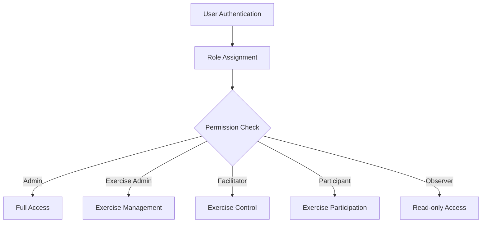

### Role-Based Access Control Matrix

| Role | Organization Management | Exercise Creation | Exercise Control | Participation | Analytics |
|------|----------------------|-------------------|------------------|---------------|------------|
| System Admin | Full | Full | Full | Full | Full |
| Exercise Admin | View | Full | Full | Full | Full |
| Facilitator | View | View | Full | Full | Limited |
| Participant | None | None | None | Limited | None |
| Observer | None | None | None | View Only | None |

## 7.2 DATA SECURITY

### Data Protection Layers

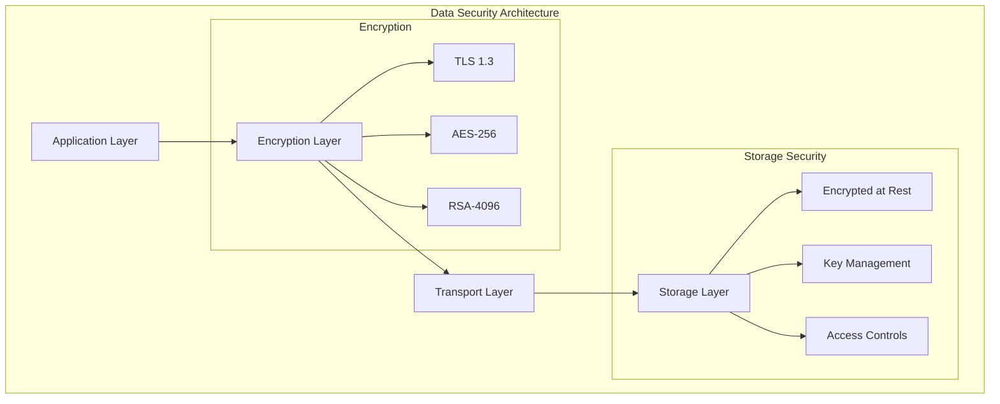

### Encryption Implementation

| Data State | Method | Key Management | Rotation Policy |
|------------|--------|----------------|-----------------|
| In Transit | TLS 1.3 | AWS Certificate Manager | 90 days |
| At Rest | AES-256-GCM | AWS KMS | 180 days |
| Backups | AES-256-CBC | Offline Master Key | Annual |
| Secrets | Vault Transit Engine | Auto-unsealing | 30 days |

### Data Classification

| Level | Description | Security Controls |
|-------|-------------|------------------|
| Critical | Exercise scenarios, organizational data | Encryption, access logging, MFA |
| Sensitive | User profiles, response data | Encryption, access control |
| Internal | Analytics, metrics | Role-based access |
| Public | Documentation, public APIs | Input validation |

## 7.3 SECURITY PROTOCOLS

### Security Implementation

```mermaid
flowchart TD
    subgraph "Security Layers"
        A[WAF] --> B[API Gateway]
        B --> C[Authentication]
        C --> D[Authorization]
        D --> E[Application]
        
        F[DDoS Protection] --> A
        G[Rate Limiting] --> B
        H[Audit Logging] --> C
        I[Session Management] --> D
    end
```

### Security Controls

| Category | Implementation | Monitoring |
|----------|----------------|------------|
| Network Security | AWS Shield, WAF | Real-time threat detection |
| API Security | Rate limiting, input validation | Request logging |
| Application Security | OWASP compliance, dependency scanning | Vulnerability scanning |
| Infrastructure Security | VPC isolation, security groups | CloudWatch metrics |

### Security Compliance Requirements

| Framework | Requirements | Implementation |
|-----------|--------------|----------------|
| SOC 2 Type II | Access control, encryption | RBAC, AES-256 |
| GDPR | Data privacy, consent | Data classification, audit logs |
| HIPAA | PHI protection | Encryption, access controls |
| ISO 27001 | Security management | Security policies, procedures |

### Security Monitoring and Response

| Component | Tool | Purpose |
|-----------|------|---------|
| SIEM | ELK Stack | Log aggregation and analysis |
| Threat Detection | AWS GuardDuty | Real-time threat monitoring |
| Vulnerability Management | Snyk | Dependency scanning |
| Access Monitoring | CloudTrail | API activity tracking |
| Incident Response | PagerDuty | Alert management |

# 8. INFRASTRUCTURE

## 8.1 DEPLOYMENT ENVIRONMENT

```mermaid
graph TB
    subgraph "Production Environment"
        subgraph "Primary Region"
            A[Load Balancer] --> B[Web Tier]
            B --> C[Application Tier]
            C --> D[Data Tier]
        end
        
        subgraph "Secondary Region"
            E[Load Balancer] --> F[Web Tier]
            F --> G[Application Tier]
            G --> H[Data Tier]
        end
        
        I[Global CDN] --> A
        I --> E
        
        J[Route 53] --> I
    end
```

| Environment | Configuration | Purpose |
|-------------|--------------|----------|
| Production | Multi-region active-active | Primary service delivery |
| Staging | Single region | Pre-production validation |
| Development | Single region | Development and testing |
| DR | Multi-region passive | Business continuity |

## 8.2 CLOUD SERVICES

| Service Category | AWS Service | Purpose | Configuration |
|-----------------|-------------|----------|---------------|
| Compute | EKS | Container orchestration | Production: r6g.xlarge, Dev: t3.large |
| Database | DocumentDB | Primary data store | Production: r6g.2xlarge, Dev: t3.large |
| Cache | ElastiCache | Session and data cache | Production: r6g.xlarge, Dev: t3.medium |
| Storage | S3 | Object storage | Standard tier with lifecycle policies |
| CDN | CloudFront | Global content delivery | Edge locations in all major regions |
| DNS | Route 53 | DNS management | Active-active routing policy |
| Security | WAF, Shield | DDoS protection | Enterprise tier protection |
| Monitoring | CloudWatch | System monitoring | Enhanced metrics enabled |

## 8.3 CONTAINERIZATION

```mermaid
graph TB
    subgraph "Container Architecture"
        A[Base Image] --> B[Runtime Image]
        B --> C[Application Image]
        
        subgraph "Microservices"
            C --> D[Web Service]
            C --> E[Exercise Service]
            C --> F[Analytics Service]
            C --> G[Notification Service]
        end
    end
```

| Component | Base Image | Size | Configuration |
|-----------|------------|------|---------------|
| Web Frontend | node:20-alpine | <200MB | Nginx, React build |
| API Services | node:20-alpine | <250MB | Express, runtime deps |
| AI Services | python:3.11-slim | <500MB | FastAPI, ML libraries |
| Workers | python:3.11-slim | <400MB | Celery, processing deps |

## 8.4 ORCHESTRATION

```mermaid
graph TB
    subgraph "Kubernetes Architecture"
        A[Ingress Controller] --> B[Service Mesh]
        B --> C[Application Pods]
        C --> D[Persistent Storage]
        
        subgraph "Pod Management"
            E[HPA] --> C
            F[PDB] --> C
            G[Network Policies] --> C
        end
    end
```

| Component | Implementation | Configuration |
|-----------|---------------|---------------|
| Cluster Management | EKS 1.27+ | Multi-AZ, managed node groups |
| Service Mesh | Istio 1.20+ | mTLS, traffic management |
| Ingress | NGINX Ingress | SSL termination, rate limiting |
| Autoscaling | HPA/VPA | CPU/Memory based scaling |
| Storage | EBS CSI | gp3 volumes for persistence |
| Secrets | External Secrets | AWS Secrets Manager integration |

## 8.5 CI/CD PIPELINE

```mermaid
graph LR
    A[Code Push] --> B[GitHub Actions]
    B --> C[Build]
    C --> D[Test]
    D --> E[Security Scan]
    E --> F[Deploy to Dev]
    F --> G[Integration Tests]
    G --> H[Deploy to Staging]
    H --> I[E2E Tests]
    I --> J[Deploy to Prod]
```

| Stage | Tools | Configuration | SLAs |
|-------|-------|---------------|------|
| Source Control | GitHub Enterprise | Protected branches, signed commits | < 1min |
| Build | GitHub Actions | Multi-arch builds, caching | < 5min |
| Testing | Jest, Pytest | Parallel execution, coverage > 80% | < 10min |
| Security | Snyk, SonarQube | Critical/High blocks, SAST/DAST | < 15min |
| Deployment | ArgoCD | GitOps, progressive delivery | < 5min |
| Monitoring | Datadog | APM, logging, metrics | Real-time |

### Deployment Strategy

| Environment | Strategy | Rollback Time | Validation |
|-------------|----------|---------------|------------|
| Development | Direct push | Immediate | Automated tests |
| Staging | Blue/Green | < 1 minute | Integration tests |
| Production | Canary | < 5 minutes | Synthetic monitoring |
| DR | Active-passive | < 15 minutes | Health checks |

# APPENDICES

## A.1 ADDITIONAL TECHNICAL INFORMATION

### A.1.1 Exercise Types Supported

| Type | Description | Typical Duration | Participants |
|------|-------------|------------------|--------------|
| Security Incident | Cybersecurity breach scenarios | 60-90 mins | Security teams, IT Ops |
| Business Continuity | Operational disruption exercises | 45-60 mins | BC teams, Management |
| Compliance Validation | Framework-specific scenarios | 60 mins | Compliance, Security |
| Crisis Management | Executive decision exercises | 30-45 mins | Executive team |
| Technical Recovery | System restoration drills | 90-120 mins | IT Ops, Development |

### A.1.2 AI Model Configuration

```mermaid
graph TD
    A[Organization Context] --> B[LLM Service]
    B --> C{Scenario Generation}
    C --> D[Base Scenario]
    C --> E[Dynamic Injects]
    C --> F[Response Validation]
    
    G[Compliance Requirements] --> B
    H[Industry Patterns] --> B
    I[Historical Data] --> B
```

### A.1.3 Integration Capabilities Matrix

| System | Authentication | Data Exchange | Real-time | Batch |
|--------|----------------|---------------|-----------|-------|
| Microsoft Teams | OAuth 2.0 | REST/WebSocket | Yes | No |
| Slack | OAuth 2.0 | Events API | Yes | No |
| Google Calendar | OAuth 2.0 | CalDAV | No | Yes |
| Outlook | OAuth 2.0 | Graph API | Yes | Yes |
| Zoom | JWT | REST | Yes | No |
| Jira | OAuth 2.0/PAT | REST | No | Yes |

## A.2 GLOSSARY

| Term | Definition |
|------|------------|
| Canary Deployment | Progressive rollout of changes to a subset of users before full deployment |
| Circuit Breaker | Design pattern that prevents cascading failures in distributed systems |
| Dark Mode | UI color scheme using darker colors to reduce eye strain |
| GitOps | Infrastructure and operational procedures managed through Git |
| Hot Reload | Development feature allowing code changes to reflect immediately without restart |
| Inject | Scenario event or update delivered during an exercise |
| Material Design | Google's design system for creating consistent, modern UIs |
| Microservices | Architectural style structuring an application as independent services |
| Progressive Delivery | Strategy for releasing features gradually with controlled risk |
| Service Mesh | Infrastructure layer handling service-to-service communication |
| Synthetic Monitoring | Automated tests simulating user behavior to monitor system health |
| Zero Trust | Security model requiring strict verification for all network access |

## A.3 ACRONYMS

| Acronym | Full Form |
|---------|-----------|
| APM | Application Performance Monitoring |
| CCPA | California Consumer Privacy Act |
| CDN | Content Delivery Network |
| CSP | Content Security Policy |
| DAST | Dynamic Application Security Testing |
| DDoS | Distributed Denial of Service |
| E2E | End-to-End |
| GDPR | General Data Protection Regulation |
| HPA | Horizontal Pod Autoscaler |
| MTTR | Mean Time To Recovery |
| RBAC | Role-Based Access Control |
| SAST | Static Application Security Testing |
| SLO | Service Level Objective |
| SSO | Single Sign-On |
| VPA | Vertical Pod Autoscaler |
| WAF | Web Application Firewall |
| WCAG | Web Content Accessibility Guidelines |
| XSS | Cross-Site Scripting |

## A.4 REVISION HISTORY

| Version | Date | Author | Changes |
|---------|------|--------|---------|
| 1.0.0 | 2024-01-15 | Initial Team | Initial document creation |
| 1.0.1 | 2024-01-20 | Tech Lead | Added integration details |
| 1.0.2 | 2024-01-25 | Security Team | Updated security requirements |
| 1.1.0 | 2024-02-01 | Architecture Team | Added system architecture |
| 1.2.0 | 2024-02-15 | Development Team | Updated technical specifications |