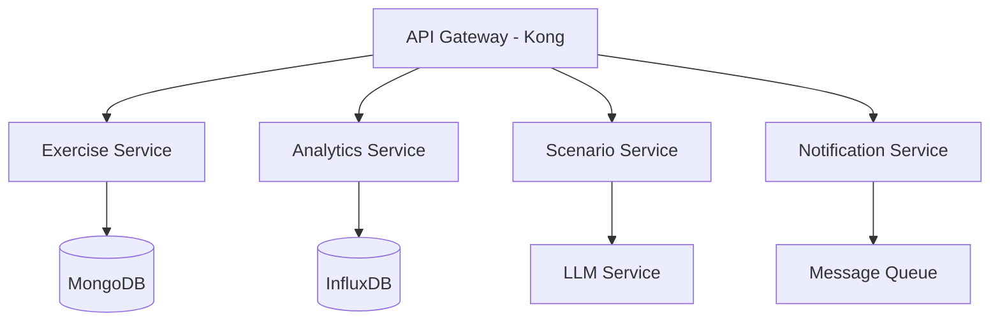

# GameDay Platform - Backend Services

[](https://github.com/gameday-platform/backend/actions)
[](https://codecov.io/gh/gameday-platform/backend)
[](LICENSE)
[](package.json)
[](pyproject.toml)

## Overview

The GameDay Platform backend implements a robust microservices architecture designed to deliver AI-driven tabletop exercises for Information Security, IT Operations, and Business Continuity teams. This documentation provides comprehensive guidance for setting up, developing, and deploying the backend services.

## Architecture

### System Components


### Key Features
- Microservices architecture with independent scaling
- Event-driven communication patterns
- Multi-region deployment support
- Real-time data processing
- AI-powered scenario generation

## Prerequisites

### Required Software
- Node.js >=20.0.0
- Python 3.11+
- Docker & Docker Compose
- AWS CLI
- kubectl

### Development Tools
- Visual Studio Code or JetBrains IDE
- Postman for API testing
- MongoDB Compass
- Redis CLI

## Project Structure

```
backend/
├── src/
│   ├── gateway/                 # Kong API Gateway configuration
│   ├── exercise-service/        # Exercise management service
│   ├── analytics-service/       # Analytics and reporting service
│   ├── scenario-service/        # AI scenario generation service
│   ├── notification-service/    # Multi-channel notification service
│   └── shared/                 # Shared utilities and types
├── deploy/                     # Deployment configurations
├── docker/                     # Docker configurations
├── scripts/                    # Development and deployment scripts
├── tests/                      # Integration and E2E tests
└── docs/                      # Additional documentation
```

## Getting Started

### Environment Setup

```bash
# Clone the repository
git clone https://github.com/gameday-platform/backend.git
cd backend

# Install dependencies
npm install

# Set up environment variables
cp .env.example .env

# Start development environment
docker-compose up -d

# Verify services
curl http://localhost:8001/status
```

### Configuration

Create a `.env` file with the following required variables:

```bash
# Core
NODE_ENV=development
LOG_LEVEL=debug

# Services
EXERCISE_SERVICE_PORT=3000
ANALYTICS_SERVICE_PORT=3001
SCENARIO_SERVICE_PORT=3002
NOTIFICATION_SERVICE_PORT=3003

# Databases
MONGODB_URI=mongodb://localhost:27017/gameday
INFLUXDB_URL=http://localhost:8086
REDIS_URL=redis://localhost:6379

# Authentication
JWT_SECRET=your-secret-key
AUTH0_DOMAIN=your-domain
AUTH0_AUDIENCE=your-audience

# AI Services
OPENAI_API_KEY=your-api-key
```

## Services

### API Gateway (Kong)
- Traffic management and routing
- Authentication and authorization
- Rate limiting and caching
- API versioning
- Request/response transformation

### Exercise Service
- Exercise lifecycle management
- Participant coordination
- Real-time state management
- Timeline tracking
- Response validation

### Analytics Service
- Performance metrics collection
- Gap analysis
- Compliance reporting
- Trend analysis
- Real-time dashboards

### Scenario Service
- AI-driven scenario generation
- Dynamic inject creation
- Compliance validation
- Context-aware adaptations
- LLM integration

### Notification Service
- Multi-channel delivery (Teams, Slack)
- Template management
- Delivery tracking
- Rate limiting
- Fallback handling

## Development

### Local Development

```bash
# Start specific service
npm run dev:exercise-service

# Run tests
npm run test

# Lint code
npm run lint

# Build services
npm run build
```

### Testing Strategy

```bash
# Unit tests
npm run test:unit

# Integration tests
npm run test:integration

# E2E tests
npm run test:e2e

# Generate coverage report
npm run test:coverage
```

### Security Implementation

- JWT-based authentication
- Role-based access control (RBAC)
- API key management
- Request validation
- Rate limiting
- CORS configuration
- Security headers

### Performance Optimization

- Response caching
- Database indexing
- Connection pooling
- Load balancing
- Resource optimization
- Query optimization

## Deployment

### Development Environment

```bash
# Deploy to development
npm run deploy:dev

# Verify deployment
npm run verify:dev
```

### Production Environment

```bash
# Deploy to production
npm run deploy:prod

# Verify deployment
npm run verify:prod
```

### Monitoring Setup

- Prometheus metrics collection
- Grafana dashboards
- ELK stack for logging
- Jaeger for tracing
- Custom health checks

## Troubleshooting

### Common Issues

1. Service Connection Issues
```bash
# Verify service health
curl http://localhost:8001/status

# Check service logs
docker-compose logs -f service-name
```

2. Database Connection Issues
```bash
# Verify MongoDB connection
mongosh --eval "db.adminCommand('ping')"

# Check Redis connection
redis-cli ping
```

### Debug Mode

```bash
# Enable debug logging
export DEBUG=gameday:*

# Run service in debug mode
npm run dev:debug
```

## Contributing

### Development Workflow

1. Fork the repository
2. Create a feature branch
3. Implement changes
4. Add tests
5. Submit pull request

### Code Standards

- ESLint configuration
- Prettier formatting
- TypeScript strict mode
- Jest test coverage
- Documentation requirements

### Review Process

1. Code review requirements
2. Test coverage thresholds
3. Documentation updates
4. Performance benchmarks
5. Security review

## License

MIT License - see [LICENSE](LICENSE) for details

## Support

- GitHub Issues: [Report Bug](https://github.com/gameday-platform/backend/issues)
- Documentation: [Wiki](https://github.com/gameday-platform/backend/wiki)
- Slack Channel: #gameday-platform-support