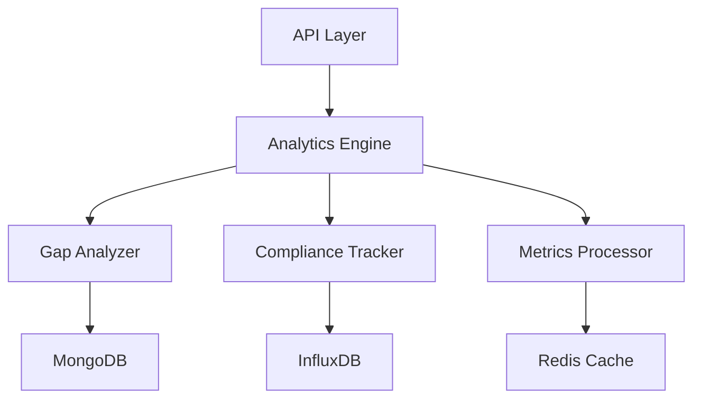

# GameDay Platform - Analytics Service

## Overview

The Analytics Service is a core component of the GameDay Platform, providing real-time metrics processing, AI-driven gap analysis, and comprehensive compliance tracking capabilities. This service enables organizations to gain actionable insights from tabletop exercises through automated analysis and visualization of performance data.

Key capabilities include:
- Real-time metrics processing with sub-second latency
- AI-driven gap analysis and identification
- Automated compliance coverage tracking (95% mapping target)
- Multi-dimensional performance trend analysis
- Context-aware recommendation generation
- Interactive data visualization
- Custom metric definition support
- Automated anomaly detection

## Features

### Real-time Analytics
- Sub-second metric processing and analysis
- Live performance monitoring during exercises
- Dynamic threshold adjustment
- Real-time alerting capabilities

### Gap Analysis
- AI-powered gap identification
- Automated compliance mapping
- Risk-based prioritization
- Trend analysis and forecasting

### Compliance Tracking
- Automated framework mapping
- Real-time coverage monitoring
- Gap identification and reporting
- Compliance score calculation

### Performance Analysis
- Multi-dimensional trend analysis
- Custom metric definition
- Historical data comparison
- Predictive analytics

## Architecture

### Component Overview


### Data Flow
- Ingestion Layer: Real-time event processing
- Processing Layer: Metric computation and analysis
- Storage Layer: Time-series and document storage
- Cache Layer: Real-time data access
- API Layer: RESTful and WebSocket interfaces

## Prerequisites

| Component | Requirement |
|-----------|-------------|
| Python | 3.11+ |
| MongoDB | 6.0+ |
| InfluxDB | 2.7+ |
| Redis | 7.0+ |
| Memory | 4GB RAM minimum |
| Storage | 20GB SSD |
| OS | Linux/Unix-based system |

## Installation

### Using Poetry
```bash
# Production installation
poetry install --no-dev

# Development installation
poetry install
```

### Using Docker
```bash
# Build image
docker build -t gameday/analytics-service:latest .

# Run container
docker run -d \
    -p 8000:8000 \
    -e MONGODB_URI=mongodb://localhost:27017 \
    -e INFLUXDB_URL=http://localhost:8086 \
    -e REDIS_URL=redis://localhost:6379 \
    gameday/analytics-service:latest
```

## Configuration

### Environment Variables
```bash
# Database Configuration
MONGODB_URI=mongodb://localhost:27017/gameday
INFLUXDB_URL=http://localhost:8086
INFLUXDB_TOKEN=your_token_here
REDIS_URL=redis://localhost:6379

# Service Configuration
SERVICE_PORT=8000
LOG_LEVEL=INFO
BATCH_SIZE=100
CACHE_TTL=300

# Feature Flags
ENABLE_AI_ANALYSIS=true
ENABLE_REAL_TIME_ALERTS=true
```

## Development

### Setup Development Environment
```bash
# Install dependencies
poetry install

# Run tests
poetry run pytest --cov=analytics_service tests/

# Run linting
poetry run flake8 analytics_service tests

# Run type checking
poetry run mypy analytics_service
```

### API Documentation
API documentation is available at `/docs` when running the service:
- OpenAPI specification
- Interactive API explorer
- Authentication details
- Request/response examples

## Troubleshooting

| Issue | Solution |
|-------|----------|
| Database Connection | Verify MongoDB and InfluxDB connection strings and credentials |
| Performance Degradation | Check Redis cache configuration and memory allocation |
| Data Inconsistency | Verify time synchronization across services |
| High Memory Usage | Adjust batch processing parameters and garbage collection settings |

## Monitoring

### Health Checks
- `/health`: Service health status
- `/metrics`: Prometheus metrics endpoint
- `/ready`: Readiness probe endpoint
- `/live`: Liveness probe endpoint

### Metrics
- Request latency
- Processing throughput
- Error rates
- Cache hit ratios
- Database connection pool status

## Support and Contact

- **Team**: GameDay Platform Team
- **Email**: support@gameday.io
- **Slack**: #gameday-analytics-support
- **Repository**: github.com/gameday/analytics-service
- **Documentation**: docs.gameday.io/analytics-service
- **Issue Tracking**: gameday.atlassian.net/analytics

## License

Copyright (c) 2024 GameDay Platform. All rights reserved.