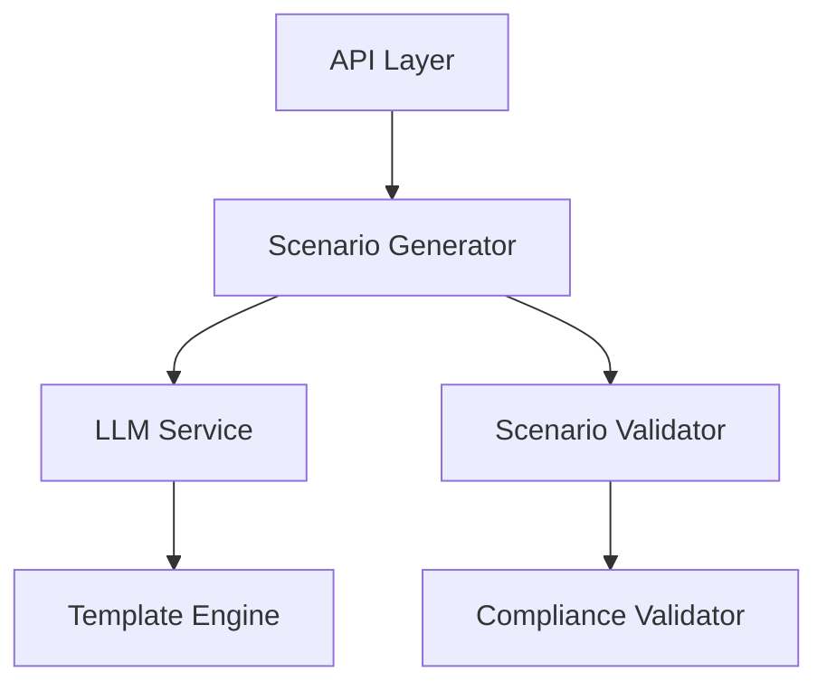

# Scenario Service

Enterprise-grade service for generating, validating, and managing AI-driven tabletop exercise scenarios with strict compliance framework alignment.

Version: 1.0.0

## Overview

The Scenario Service is a core component of the GameDay Platform that provides sophisticated AI-driven scenario generation capabilities with comprehensive compliance validation, intelligent caching, and enterprise-grade reliability features.

### Key Features

- AI-driven scenario generation with LangChain integration
- Multi-framework compliance validation (SOC 2, GDPR, etc.)
- Dynamic inject generation with timeline optimization
- Intelligent caching and performance optimization
- Comprehensive validation and error handling
- Enterprise-grade monitoring and telemetry

## Architecture

The service follows a modular architecture with clear separation of concerns:



### Core Components

- **Scenario Generator**: Orchestrates scenario creation with AI assistance
- **LLM Service**: Manages LLM interactions with caching and retry logic
- **Scenario Validator**: Ensures scenario quality and compliance
- **Template Engine**: Handles scenario templates and customization
- **Compliance Validator**: Validates against regulatory frameworks

## Installation

### Prerequisites

- Python 3.11+
- Poetry 1.7.0+
- MongoDB 6.0+
- Redis 7.0+

### Setup

1. Install dependencies:
```bash
poetry install
```

2. Configure environment variables:
```bash
cp .env.example .env
# Edit .env with your configuration
```

3. Run development server:
```bash
poetry run uvicorn scenario_service.main:app --reload
```

## Configuration

The service uses a hierarchical configuration system with the following priority:

1. Environment variables
2. Configuration file
3. Default values

### Key Configuration Parameters

```python
# Service Configuration
SERVICE_NAME = "scenario-service"
SERVICE_PORT = 8003
ENVIRONMENT = "development"  # development, staging, production

# LLM Configuration
LLM_PROVIDER = "openai"  # openai, azure
MODEL_VERSION = "gpt-4"
TEMPERATURE = 0.7
MAX_TOKENS = 2048

# Database Configuration
MONGODB_URI = "mongodb://localhost:27017/gameday"
REDIS_URI = "redis://localhost:6379/0"

# Compliance Configuration
COMPLIANCE_THRESHOLD = 0.95
VALIDATION_LEVEL = "strict"  # strict, standard
```

## API Documentation

### Core Endpoints

#### Generate Scenario
```http
POST /api/v1/scenarios/generate
Content-Type: application/json

{
    "type": "security_incident",
    "organization_context": {
        "industry": "finance",
        "size": "enterprise",
        "region": "us-east"
    },
    "compliance_frameworks": ["soc2", "gdpr"],
    "complexity_level": 3
}
```

#### Validate Scenario
```http
POST /api/v1/scenarios/validate
Content-Type: application/json

{
    "scenario_id": "uuid",
    "validation_level": "strict",
    "compliance_frameworks": ["soc2"]
}
```

## Development

### Project Structure

```
scenario_service/
├── api/                 # API endpoints and routing
├── models/             # Data models and schemas
├── services/           # Core business logic
│   ├── scenario_generator.py
│   ├── llm_service.py
│   └── scenario_validator.py
├── utils/              # Utility functions
│   ├── compliance.py
│   └── templates.py
└── config.py          # Configuration management
```

### Testing

Run the test suite:
```bash
poetry run pytest
```

With coverage:
```bash
poetry run pytest --cov=scenario_service
```

### Code Quality

Maintain code quality with:
```bash
# Format code
poetry run black scenario_service/

# Type checking
poetry run mypy scenario_service/

# Linting
poetry run flake8 scenario_service/
```

## Deployment

### Docker

Build the container:
```bash
docker build -t scenario-service:1.0.0 .
```

Run with Docker Compose:
```bash
docker-compose up -d
```

### Kubernetes

Deploy to Kubernetes:
```bash
kubectl apply -f k8s/
```

## Monitoring

The service exposes metrics and health endpoints:

- Health Check: `/health`
- Metrics: `/metrics`
- OpenAPI Docs: `/docs`

### Key Metrics

- Scenario generation latency
- Compliance validation scores
- Cache hit rates
- LLM API performance
- Error rates by type

## Security

- TLS 1.3 encryption in transit
- JWT authentication
- Role-based access control
- Input validation and sanitization
- Rate limiting
- Audit logging

## License

Copyright (c) 2024 GameDay Platform. All rights reserved.